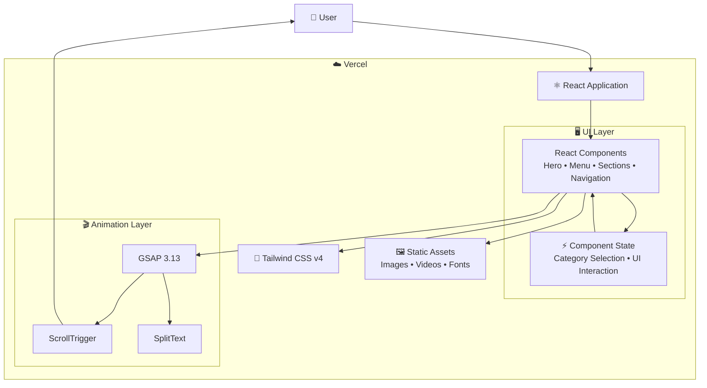
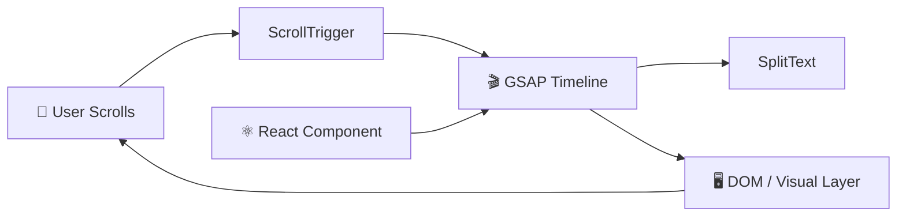

# Velvet Pour

> **Live Demo:** [https://cocktail-website-lilac.vercel.app/]


## About

Velvet Pour is a cocktail bar website built with React, TypeScript, Tailwind CSS v4, and GSAP. Features include animated scroll-triggered reveals, a cocktail menu with category tabs, a parallax hero section, and a responsive layout optimized for all devices.

## Tech Stack

- React 19 + TypeScript
- Vite
- Tailwind CSS v4
- GSAP 3.13 (ScrollTrigger, SplitText)

## Getting Started

```bash
npm install
npm run dev
```

## Build

```bash
npm run build
npm run preview
```

## ✦ Architecture & Data Flow

Velvet Pour follows a lightweight **client-side React architecture** focused on interactive UI, responsive design, and animation-driven user experiences. The application runs entirely in the browser, with Vite handling development/build tooling and GSAP controlling the animation layer.

<br />

### 🏗️ High-Level Architecture



<br />

### 🔄 Application Flow

```text
                         👤 USER
                            │
                            ▼
                    ⚛️ REACT APPLICATION
                            │
              ┌─────────────┼─────────────┐
              │             │             │
              ▼             ▼             ▼
        🧭 Navigation   🍹 Menu UI    🎬 Hero / Sections
              │             │             │
              │             ▼             │
              │       ⚡ React State       │
              │             │             │
              └─────────────┼─────────────┘
                            ▼
                    🎬 GSAP ANIMATION
                            │
             ┌──────────────┼──────────────┐
             │              │              │
             ▼              ▼              ▼
        ScrollTrigger    SplitText     Parallax
             │              │              │
             └──────────────┼──────────────┘
                            ▼
                     🖥️ BROWSER UI
                            │
                            ▼
                         👤 USER
```

<br />

### 🍹 Cocktail Menu Flow

The cocktail menu uses client-side state to switch between categories without requiring a backend request.

```text
👤 User
   │
   ▼
🍹 Select Category
   │
   ▼
⚡ React State Update
   │
   ▼
📋 Filter / Select Cocktails
   │
   ▼
🎨 React Re-render
   │
   ▼
🍸 Updated Cocktail Menu
```

This keeps category switching immediate because the interaction is handled locally within the browser.

<br />

### 🎬 GSAP Animation Architecture

GSAP acts as the animation engine on top of the React component structure.



### Animation Responsibilities

| Technology        | Responsibility                              |
| ----------------- | ------------------------------------------- |
| **GSAP**          | Core animation engine                       |
| **ScrollTrigger** | Scroll-based animation timing and triggers  |
| **SplitText**     | Character/word-based text reveal animations |
| **React**         | Component lifecycle and UI structure        |
| **Tailwind CSS**  | Layout, responsiveness and visual styling   |

<br />

### 🖼️ Static Asset Flow

Images and other frontend assets are loaded directly by the client application.

```text
☁️ Vercel
   │
   ▼
📦 Static Assets
   │
   ├── Images
   ├── Video / Media
   └── Other public assets
   │
   ▼
⚛️ React Components
   │
   ▼
🖥️ Browser
   │
   ▼
👤 User
```

<br />

### 📱 Responsive UI Flow

The responsive experience is handled primarily through Tailwind CSS utilities and React's component structure.

```text
                    ⚛️ React UI
                         │
                         ▼
                 🎨 Tailwind CSS
                         │
            ┌────────────┼────────────┐
            │            │            │
            ▼            ▼            ▼
         📱 Mobile    💻 Tablet    🖥️ Desktop
            │            │            │
            └────────────┼────────────┘
                         ▼
                  Responsive Layout
```

<br />

### ⚡ Build & Deployment Architecture

Vite handles the local development server and production build process, while Vercel serves the resulting frontend application.

```text
👨‍💻 Developer
     │
     ▼
📁 Source Code
     │
     ▼
⚡ Vite
     │
     ├── npm run dev
     │       │
     │       ▼
     │   localhost:5173
     │
     └── npm run build
             │
             ▼
       📦 Production Build
             │
             ▼
        ☁️ Vercel
             │
             ▼
        🌍 Global Web App
             │
             ▼
           👤 User
```

<br />

### 🧠 Architecture Principles

| Layer               | Responsibility                                  |
| ------------------- | ----------------------------------------------- |
| **React**           | Component-based UI architecture                 |
| **TypeScript**      | Static typing and safer application development |
| **Vite**            | Development server and production build tooling |
| **Tailwind CSS v4** | Responsive styling and layout                   |
| **GSAP**            | High-performance animations                     |
| **ScrollTrigger**   | Scroll-driven animation control                 |
| **SplitText**       | Advanced text reveal effects                    |
| **Browser**         | Client-side rendering and interaction           |
| **Vercel**          | Production hosting and deployment               |

<br />

### 🔁 Complete System Flow

```text
                         👤 USER
                            │
                            ▼
                    ☁️ VERCEL HOSTING
                            │
                            ▼
                     ⚛️ REACT APP
                            │
             ┌──────────────┼──────────────┐
             │              │              │
             ▼              ▼              ▼
        🧭 Navigation    🍹 Menu       🎬 Sections
             │              │              │
             │              ▼              │
             │        ⚡ React State        │
             │              │              │
             └──────────────┼──────────────┘
                            ▼
                     🎬 GSAP ENGINE
                            │
             ┌──────────────┼──────────────┐
             │              │              │
             ▼              ▼              ▼
       ScrollTrigger     SplitText     Parallax
             │              │              │
             └──────────────┼──────────────┘
                            ▼
                     🖥️ BROWSER UI
                            │
                            ▼
                         👤 USER
```

<br />

**Key architectural characteristic:** Velvet Pour is intentionally a **frontend-only, animation-driven application**. There is no dedicated backend, database, or external API in the current architecture. React manages the interface and interaction state, while GSAP provides the animation layer and Vite handles development and production builds.
